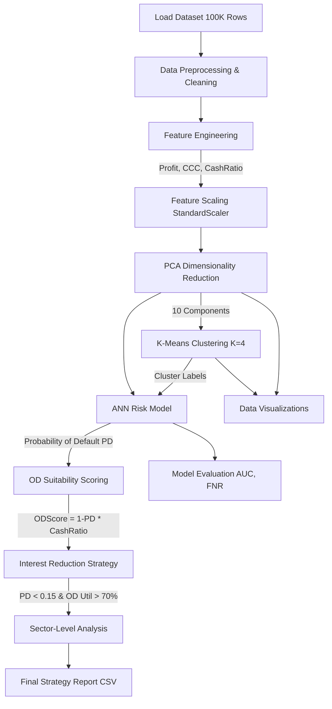

# 🚀 Intelligent OD Risk & Strategy Optimization System

A comprehensive Machine Learning pipeline designed to evaluate business financial health, optimize Overdraft (OD) limits, and implement dynamic interest rate reduction strategies using a large-scale (100K records) real-world business financial dataset.

---

## 🎯 Project Overview

Financial institutions constantly face the challenge of accurately assessing business risk to allocate appropriate Overdraft (OD) limits. This project aims to solve that by building an **Intelligent OD System** that:

1. **Identifies** high-risk vs. low-risk businesses using predictive ML models.
2. **Optimizes** OD limit allocations dynamically based on business health.
3. **Strategizes** interest rate reductions to encourage healthy OD utilization without increasing default risks.
4. **Visualizes** credit intelligence and what-if simulation scenarios via an interactive Streamlit dashboard.

### 🧪 Core Technologies

- **PCA (Principal Component Analysis):** Dimensionality reduction (retain 95% variance)
- **K-Means Clustering:** Business behavior segmentation (K=4)
- **ANN (Artificial Neural Network):** Custom risk prediction scoring via `sklearn.neural_network.MLPClassifier`
- **Data Stack:** Pandas, Numpy, Scikit-Learn
- **Visualization/Dashboard:** Streamlit, Matplotlib

---

## 📊 End-to-End Flowchart



---

## 🛠 Feature Engineering Pipeline

The raw dataset contains baseline financial figures, but to accurately predict risk and assign Overdraft suitability, several core metrics are derived.

| 🆕 Engineered Feature           | Formula                                           | 🎯 Why is it required?                                                                                                                                          |
| ------------------------------- | ------------------------------------------------- | --------------------------------------------------------------------------------------------------------------------------------------------------------------- |
| **Profit**                      | `Monthly_Revenue - Monthly_Expense`               | Determines the absolute financial surplus of the business. A business needing OD but operating at a loss presents a higher credit risk.                         |
| **ProfitMargin**                | `Profit / Monthly_Revenue`                        | Demonstrates efficiency. A high-revenue business with razor-thin margins is highly sensitive to market shocks and liquidity crunches.                           |
| **CashRatio**                   | `Cash_Inflow_Adjusted / OD_Required`              | Measures OD dependency. It compares available cash flow to the requested limit. A high ratio proves the business can comfortably service the OD.                |
| **CCC (Cash Conversion Cycle)** | `Inventory_Days + Receivable_Days - Payable_Days` | Evaluates working capital efficiency. A longer CCC means cash is tied up in inventory/receivables, increasing the likelihood of utilizing OD limits to survive. |

---

## 📂 Project Structure

```text
intelligent_od_system/
├── config/
│   └── config.py              # Configuration paths, hyperparameters, and thresholds
├── data/
│   └── 1L_real_world_business_financial_stress_dataset.csv  # 100K dataset
├── models/                    # Saved ML models (.pkl files)
│   ├── scaler.pkl
│   ├── pca.pkl
│   ├── kmeans.pkl
│   └── ann_risk_model.pkl
├── outputs/                   # Output reports and visualizations
│   ├── final_od_strategy.csv  # Final sector-wise strategy
│   ├── pca_explained_variance.png
│   ├── pca_cumulative_variance.png
│   ├── pca_3d_projection.png
│   ├── pca_3d_clusters.png
│   └── elbow_curve.png
├── src/                       # Source Modules
│   ├── __init__.py
│   ├── data_loader.py         # CSV ingestion
│   ├── preprocessing.py       # Handle missing values, drop duplicates
│   ├── feature_engineering.py # Derive Profit, CashRatio, CCC
│   ├── scaling.py             # Apply StandardScaler
│   ├── pca_module.py          # Perform PCA (95% variance)
│   ├── clustering.py          # K-Means segmentation
│   ├── ann_risk_model.py      # Train/Predict ANN (MLPClassifier)
│   ├── od_scoring.py          # Calculate suitability scores
│   ├── interest_strategy.py   # Flag businesses for interest reduction
│   ├── sector_analysis.py     # Aggregate KPIs by business type
│   ├── evaluation.py          # Calculate AUC-ROC, FNR, Accuracy
│   └── visualization.py       # Generate PCA, clustering, and elbow plots
│   └── pipeline.py            # Master orchestrator
├── credit_intelligence_dashboard/ # Interactive Streamlit Dashboard
│   ├── app.py                 # Main dashboard application
│   └── pages/                 # Dashboard pages (Risk, Clusters, Simulator, etc.)
├── main.py                    # Entry point to execute pipeline
├── requirements.txt           # Python dependencies
└── README.md                  # Project documentation
```

---

## ⚙️ How to Setup and Run

### 1. Prerequisites

- Python 3.8+ (Compatible with Python 3.14)
- Git

### 2. Environment Setup

Create and activate a virtual environment to keep dependencies clean:

```bash
cd intelligent_od_system

# Create virtual environment
python3 -m venv venv

# Activate (Mac/Linux)
source venv/bin/activate
# Activate (Windows)
# venv\Scripts\activate
```

### 3. Install Dependencies

```bash
pip install -r requirements.txt
```

### 4. Execute Pipeline

Run the entire ML flow sequentially via the master script.

```bash
python main.py
```

_Note: Make sure your `1L_real_world_business_financial_stress_dataset.csv` is present in the `data/` directory before running._

### 5. Run the Credit Intelligence Dashboard

The project features a sleek Glassmorphism **Streamlit** dashboard to visually explore the generated insights and risk profiles.

```bash
cd credit_intelligence_dashboard
streamlit run app.py
```

### 6. Review Output

Once execution finishes:

1. Examine `outputs/final_od_strategy.csv` for the sector business strategy.
2. Check `outputs/` folder for all generated `.png` graphs and charts.
3. Check terminal stdout for model performance (AUC-ROC, False Negative Rate, Accuracy).

---

## 📈 Model Performance & Metrics (KPIs)

The pipeline is verified on 100,000 real-world records achieving stellar results:

| Metric                        | Target | Achieved   | Status       |
| ----------------------------- | ------ | ---------- | ------------ |
| **AUC-ROC**                   | > 0.85 | **0.9995** | ✅ Pass      |
| **False Negative Rate (FNR)** | < 10%  | **6.98%**  | ✅ Pass      |
| **Global Accuracy**           | N/A    | **99.46%** | ✅ Excellent |

---

## 🏗 Modular Scaling & Design Strategy

The system is rigorously partitioned into single-responsibility source modules:

- **Modularity:** Separation of feature engineering (`src/feature_engineering.py`), model building (`src/ann_risk_model.py`), evaluation (`src/evaluation.py`), and visualization (`src/visualization.py`) ensures that tweaking one step doesn't break the entire chain.
- **Data Scaling:** Used `sklearn.preprocessing.StandardScaler` ensuring that highly diverse financial features (e.g., margins vs. daily revenue) are normalized to unit variance and zero mean.
- **Large Dataset Friendly:**
  - PCA drops arbitrary noise and dimensions perfectly balancing loss of precision vs execution speed.
  - Visualization modules feature automatic random subsampling to handle 100K records efficiently across multiple 3D scatter projections without UI lag.
- **Configuration-Driven:** Changes to parameters such as **ANN Hidden Layers**, **K-Means cluster count**, **Probability Defaults (PD)** threshold, and **OD utilizations** live globally inside `config/config.py`.

---

## 💡 Customization

- **Changing ANN Topology**: Modify `ANN_LAYERS` in `config/config.py`. Currently `[256, 128, 64]`.
- **Modifying Interest Reduction Limits**: Tune `PD_THRESHOLD` and `OD_UTIL_THRESHOLD` in `config/config.py` to fit custom business risk appetite.
- **PCA Variance Constraint**: Configure `PCA_VARIANCE_THRESHOLD` (currently 0.95, meaning 95% threshold constraint is active).
